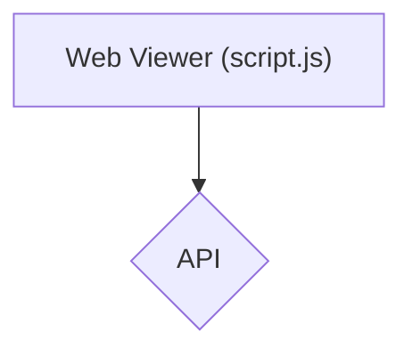
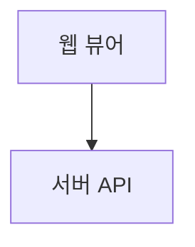
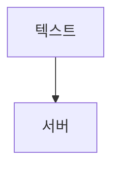
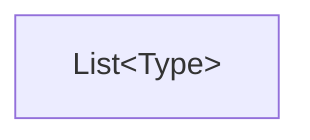
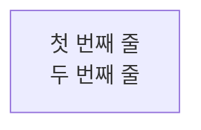

# Mermaid Diagram Rules

Mermaid 다이어그램 작성 시 VSCode 및 GitHub 렌더러에서 파싱 에러를 방지하기 위한 필수 규칙입니다.

## 1. 특수 문자 처리 - [CRITICAL]

- 노드 레이블에 괄호 `()`, `[]`, `{}`, 슬래시 `/`, 꺾쇠괄호 `<>`, 특수기호 `#*@` 등이 포함되면 **반드시 큰따옴표(`"`)로 감싸십시오**.
- **Why?**: VSCode Markdown Mermaid 확장이 HTML 엔티티를 먼저 해석하면서 괄호가 구문과 충돌하여 파싱 에러가 발생합니다.

```mermaid
graph TD
    A[Web Viewer (script.js)] --> B{API}
```



## 2. 노드 ID 규칙

- **노드 식별자(ID)는 영문자와 숫자만 사용**하십시오. 한글이나 특수문자는 레이블(큰따옴표 안)에만 사용합니다.
- 화살표 앞뒤로 **공백 한 칸씩** 권장합니다.





## 3. HTML 엔티티 (꺾쇠괄호)

- 제네릭 타입이나 HTML 태그 형태의 꺾쇠괄호는 HTML 엔티티로 변환하십시오.
  - `<` → `&lt;`
  - `>` → `&gt;`



## 4. 줄바꿈 처리

- 레이블 내부 줄바꿈은 `<br>` 또는 `\n`을 사용하십시오.



## 5. 표준 디자인 가이드 (Standard Design Guidelines)

시각적 가독성을 높이고 프로세스 구조를 명확히 하기 위한 기본 지침입니다.

### 5.1 테마 초기화 (Theme Initialization)

다이어그램 최상단에 `%%{init: { 'theme': 'base' }}%%` 설정을 포함하여 렌더러별 기본 스타일 충돌을 최소화하십시오.

### 5.2 시각적 계층화 및 그룹화

- **클래스 정의 (`classDef`)**: 프로세스의 성격(Action, Decision, Storage 등)에 따라 스타일을 구분하여 시각적 인지도를 높이십시오.
- **그룹화 (`subgraph`)**: 5개 이상의 노드가 포함된 복잡한 프로세스는 `subgraph`를 사용하여 논리적 단계별로 그룹화하십시오.

## 체크리스트

작성 완료 후 다음을 확인하십시오:

1. 특수 문자 포함 레이블을 `""`로 감쌌는가?
2. 노드 ID가 영문/숫자인가?
3. 꺾쇠괄호를 HTML 엔티티로 변환했는가?
4. 화살표 앞뒤 공백이 있는가?
5. 논리적 단계에 따라 `subgraph`나 `classDef`가 적절히 사용되었는가?
