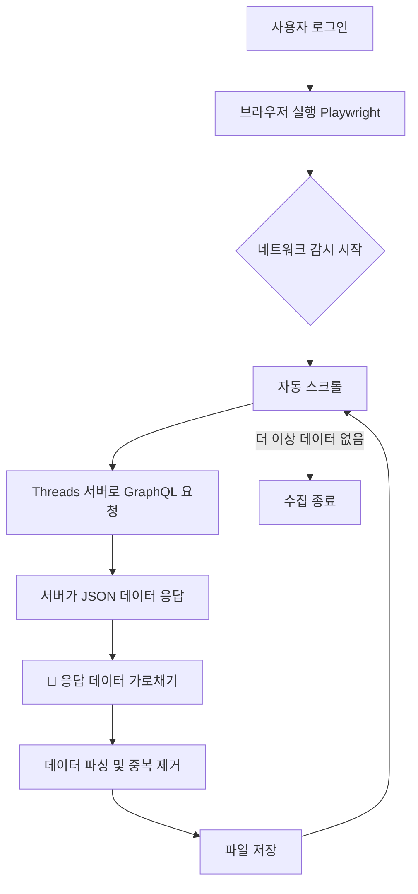

# 📱 Threads Saved Posts Crawler

Threads 플랫폼의 저장된 게시물을 자동으로 수집하고 관리하는 Python 크롤러입니다.

## ✨ 주요 기능

### 🎯 핵심 기능

- **자동 로그인**: Playwright 세션 상태 저장으로 재사용
- **네트워크 기반 수집**: DOM 가상화 문제 해결을 위한 GraphQL API 인터셉트
- **증분 업데이트**: 신규 게시물만 효율적으로 수집
- **데이터 무결성**: 메타데이터, 타임스탬프, 순서 번호로 데이터 품질 보장
- **중복 제거**: 자동 중복 감지 및 제거
- **이력 추적**: 모든 병합 작업 기록

### 📊 데이터 관리

- **하이브리드 순서 시스템**
  - `sequence_id`: 수집 순서의 절대적 기준 (1 = 가장 오래됨)
  - `crawled_at`: 배치 타임스탬프 (보조 정보)
- **파일 레벨 메타데이터**: 버전, 수집 시간, 총 개수, 데이터 품질 정보
- **병합 이력**: 모든 업데이트 작업 추적

### 🔄 크롤링 모드

1. **"all" 모드**: 처음부터 끝까지 전체 수집
2. **"update only" 모드**: 최신 데이터만 증분 수집 (기본값)

---

## 📊 Python vs JS 스크레이퍼 성능 비교

사용자 실행 데이터를 바탕으로 정밀 분석한 결과입니다.

| 항목               | JS 버전 (node.js) | Python 버전 (py) | 차이 (JS 대비)           |
| :----------------- | :---------------: | :--------------: | :----------------------- |
| **총 수집 개수**   |       163개       |      158개       | -5개 (약 3% 적음)        |
| **총 소요 시간**   |   152초 (2:32)    | **109초 (1:49)** | **43초 단축 (28% 빠름)** |
| **개당 수집 속도** |     0.93초/개     |  **0.69초/개**   | **약 26% 효율적**        |

### 🔍 Python 방식이 더 빠른 이유

- **브라우저 제어 오버헤드 최소화:** Python(Playwright)은 브라우저를 직접 실행/제어하므로, CDP 릴레이를 거치는 JS 방식보다 명령 전달이 즉각적입니다.
- **데이터 처리 최적화:** Python의 네트워크 감지 및 일괄 처리 로직이 Threads의 패킷 수신 구조에 더 최적화되어 있습니다.

### 💡 최종 가이드

- **🚀 속도 및 효율 중심:** **Python 스크레이퍼** (약 30% 더 빠름)
- **🛠️ 편의성 및 완결성 중심:** **JS 스크레이퍼** (기존 세션 활용 및 더 촘촘한 수집)

---

## 🚀 시작하기

### 1. 요구사항

- Python 3.8+
- Playwright
- Threads 계정

### 2. 설치

```bash
# 저장소 클론
cd d:/Vibe_Coding/sns_analysis

# 가상환경 생성 (선택사항)
python -m venv venv
source venv/bin/activate  # Windows: venv\Scripts\activate

# 필수 패키지 설치
pip install playwright python-dotenv

# Playwright 브라우저 설치
playwright install chromium
```

### 3. 환경 설정

`.env.local` 파일을 생성하고 Threads 계정 정보를 입력하세요:

```env
THREADS_ID=your_username
THREADS_PW=your_password
```

### 4. 실행

```bash
python scrap_all_v9.py
```

---

## ⚙️ 설정 옵션

`scrap_all_v9.py` 파일 상단에서 다음 설정을 변경할 수 있습니다:

```python
# 수집 개수 제한 (0 = 무제한)
TARGET_LIMIT = 0

# 크롤링 모드
CRAWL_MODE = "update only"  # "all" 또는 "update only"
```

---

## 📁 출력 파일 구조

### 1. 신규 크롤링 파일

**경로**: `output/threads_saved_YYYYMMDD_HHMMSS.json`

단순 배열 형태의 원본 데이터:

```json
[
  {
    "pk": "dom_DT7_LsBj_kt",
    "code": "DT7_LsBj_kt",
    "username": "user123",
    "text": "게시물 내용...",
    "url": "https://www.threads.net/@user123/post/DT7_LsBj_kt",
    "images": [...],
    "source": "initial_dom",
    "sequence_id": 142,
    "crawled_at": "2026-01-27T16:47:39.667186"
  }
]
```

### 2. Full 버전 파일 (메타데이터 포함)

**경로**: `output/threads_saved_full_YYYYMMDD.json`

메타데이터와 게시물 데이터를 포함한 구조화된 파일:

```json
{
  "metadata": {
    "version": "1.0",
    "crawled_at": "2026-01-27T16:49:02.637841",
    "total_count": 142,
    "max_sequence_id": 142,
    "first_code": "DT7_LsBj_kt",
    "last_code": "DRtU-J0E3MU",
    "crawl_mode": "update only",
    "legacy_data_count": 0,
    "verified_data_count": 142,
    "merge_history": [
      {
        "merged_at": "2026-01-27T18:55:09.123456",
        "new_items_count": 2,
        "duplicates_removed": 1,
        "source_file": "threads_saved_full_20260127.json",
        "stop_code": "DT7_LsBj_kt"
      }
    ]
  },
  "posts": [...]
}
```

---

## 📊 데이터 필드 설명

### 메타데이터 (metadata)

| 필드                  | 설명                                   |
| --------------------- | -------------------------------------- |
| `version`             | 데이터 스키마 버전                     |
| `crawled_at`          | 크롤링 수행 시각 (ISO 8601)            |
| `total_count`         | 전체 게시물 개수                       |
| `max_sequence_id`     | 가장 큰 sequence_id (= 최신 게시물)    |
| `first_code`          | 첫 번째 게시물 코드 (최신)             |
| `last_code`           | 마지막 게시물 코드 (가장 오래됨)       |
| `crawl_mode`          | 크롤링 모드 ("all" 또는 "update only") |
| `legacy_data_count`   | 타임스탬프 없는 레거시 데이터 개수     |
| `verified_data_count` | 타임스탬프 있는 검증된 데이터 개수     |
| `merge_history`       | 병합 이력 배열                         |

### 게시물 데이터 (posts)

| 필드           | 설명                                          |
| -------------- | --------------------------------------------- |
| `pk`           | Primary Key (내부 식별자)                     |
| `code`         | Threads 게시물 고유 코드                      |
| `username`     | 작성자 사용자명                               |
| `text`         | 게시물 본문                                   |
| `url`          | 게시물 URL                                    |
| `images`       | 이미지 URL 배열                               |
| `like_count`   | 좋아요 수 (수집 불가 시 -1)                   |
| `reply_count`  | 댓글 수 (수집 불가 시 -1)                     |
| `repost_count` | 리포스트 수 (수집 불가 시 -1)                 |
| `quote_count`  | 인용 수 (수집 불가 시 -1)                     |
| `posted_at`    | 게시 시각 (수집 불가 시 null)                 |
| `source`       | 수집 출처 ("initial_dom" 또는 "network")      |
| `sequence_id`  | **순서 번호** (1 = 가장 오래됨, 큰 값 = 최신) |
| `crawled_at`   | 수집 시각 (레거시 데이터는 null)              |

---

---

## 🔄 작동 원리

### 🚨 핵심 기술적 이슈: DOM Virtualization

Threads는 브라우저 메모리를 절약하기 위해 **가상 스크롤(Virtual Scrolling)** 기술을 사용합니다.

**문제점:**

- 사용자가 스크롤을 내려 100번째 글을 보고 있을 때, 브라우저는 메모리 확보를 위해 **이미 지나간 1~80번째 글을 HTML에서 제거**합니다.
- 스크롤을 끝까지 내린 후 페이지를 저장해도, **마지막에 로딩된 일부 게시글만 남고 앞부분 데이터는 모두 소실**됩니다.

> **비유:**
>
> 마치 **'회전초밥 레일'**과 같습니다. 내 눈앞에 지나가는 초밥만 집을 수 있고, 이미 지나가 버린 초밥은 레일 끝에서 사라져 버려 다시는 집을 수 없는 구조입니다.

### ✅ 해결 솔루션: Network Interception (네트워크 패킷 인터셉트)

화면에 보이는 HTML을 긁는 방식 대신, **브라우저와 서버가 주고받는 네트워크 통신을 가로채는 방식**을 채택했습니다.

**작동 방식:**

1. **자동화 브라우저(Playwright)**를 실행하여 사용자 로그인
2. 프로그램이 자동으로 스크롤을 내려 서버에 **"다음 데이터 주세요"** 요청 유도
3. 서버가 브라우저에 보내는 **JSON 데이터(GraphQL Response)**를 중간에서 가로채서 저장

**장점:**

- **데이터 무결성**: 화면에서 게시글이 사라져도 원본 데이터는 100% 수집 가능
- **속도**: HTML 분석 없이 정제된 JSON 데이터를 바로 사용
- **정확성**: 이미지 URL, 작성자 ID, 작성 시간 등 메타데이터가 정확하게 포함

---

### 1. 크롤링 프로세스



**단계별 설명:**

```
1. 자동 로그인 (또는 세션 재사용)
2. Threads 저장 페이지 접속
3. [1단계] 초기 화면 DOM 스캔 (~20개)
4. [2단계] 스크롤 + 네트워크 패킷 캡처
   - GraphQL API 인터셉트
   - stop_code 감지 시 중단
5. 중복 제거
6. sequence_id 및 crawled_at 부여
7. 파일 저장
```

### 2. "update only" 모드 동작

```
1. 최신 full 파일에서 첫 게시물 코드 추출 (stop_code)
2. stop_code 발견까지만 크롤링
3. 신규 데이터 수집
4. 기존 데이터와 병합
   - 중복 자동 제거
   - sequence_id 연속 부여
5. merge_history 추가
6. Full 파일 업데이트 또는 생성
```

### 3. sequence_id 할당 규칙

**"all" 모드:**

```python
# 총 142개 수집 시
posts[0] (최신)    → sequence_id: 142
posts[1]           → sequence_id: 141
...
posts[141] (가장 오래됨) → sequence_id: 1
```

**"update only" 모드:**

```python
# 기존: 1~142
# 신규 3개 추가 시
new_posts[0]       → sequence_id: 145
new_posts[1]       → sequence_id: 144
new_posts[2]       → sequence_id: 143
# 기존 데이터는 그대로 유지 (1~142)
```

---

## ⚠️ 제약사항 및 리스크

### 1. 세션 만료 (Session Expiry)

- 이 서비스는 사용자의 로그인 정보(Cookie)를 기반으로 작동합니다.
- 일정 시간이 지나면 로그인이 풀릴 수 있으므로, **수집 시마다 로그인이 필요**할 수 있습니다.
- **대응**: `auth.json` 파일로 세션 상태를 저장하여 재사용

### 2. API 변경 가능성

- Threads가 내부 API 구조(`graphql` 쿼리 형태)를 변경할 경우, 데이터 수집이 중단될 수 있습니다.
- **대응**: 수집 실패 시 응답 JSON 구조 확인 및 코드 업데이트 필요 (유지보수 포인트)

### 3. 과도한 요청 제한 (Rate Limiting)

- 너무 빠른 속도로 스크롤하거나 단시간에 수천 개의 글을 수집하면 로봇으로 간주되어 **일시적 차단** 가능
- **대응**: 코드 내에 `time.sleep(2)` 등 대기 시간을 두어 인간처럼 천천히 행동

### 4. 개인정보 보호

- **로그인 정보**: `.env.local` 파일을 절대 Git에 커밋하지 마세요.
- **수집 데이터**: 개인적 용도로만 사용하세요.
- **세션 파일**: `auth.json`이 오래되면 재로그인이 필요할 수 있습니다.

---

## 🛠️ 주요 함수

### `run()`

메인 크롤링 함수. 전체 프로세스 오케스트레이션.

### `find_latest_full_file()`

가장 최근의 full 파일을 찾아 경로 반환.

### `update_full_version(new_data, stop_code, crawl_start_time)`

신규 데이터와 기존 데이터를 병합하여 full 파일 업데이트.

### `manage_login(context, page)`

자동 로그인 처리 및 세션 관리.

---

## 📈 출력 예시

### 실행 로그

```
🔄 UPDATE ONLY 모드: 'DT7_LsBj_kt'까지만 수집합니다.
🚀 브라우저 실행 중...
🌐 Threads 저장 페이지 접속 시도...
✅ 자동 로그인 성공!

🔍 [1단계] 초기 화면(DOM) 스캔 중...
   + [DOM] 게시물 제목... (현재 1/무제한)
   + [DOM] 게시물 제목... (현재 2/무제한)
✋ 기준 게시물 발견! (code: DT7_LsBj_kt) - DOM 스캔 중단

📜 [2단계] 스크롤 시작 (네트워크 패킷 캡처)
✋ 기준 게시물 수집 완료! 스크롤 종료

💾 최종 데이터 2개 저장 중...
✅ 신규 크롤링 저장: output/threads_saved_20260127_185509.json
   - Network 기반: 0개
   - DOM 기반: 2개

📂 기존 Full 파일 로드: output/threads_saved_full_20260127.json
✅ 병합 완료: 2개 신규 추가 + 142개 기존 = 144개

📦 Full 버전 업데이트: output/threads_saved_full_20260127.json
   📊 데이터 품질: 타임스탬프 있음 144개 / 레거시 0개
   🔢 Sequence ID 범위: 1 ~ 144
```

---

## 🔍 데이터 활용 예시

### Python

```python
import json

# Full 파일 로드
with open('output/threads_saved_full_20260127.json', 'r', encoding='utf-8') as f:
    data = json.load(f)

# 메타데이터 확인
print(f"총 게시물: {data['metadata']['total_count']}개")
print(f"최신 수집: {data['metadata']['crawled_at']}")

# 최신 10개 게시물 (sequence_id 기준 내림차순)
recent_posts = sorted(data['posts'], key=lambda x: x['sequence_id'], reverse=True)[:10]

for post in recent_posts:
    print(f"[{post['sequence_id']}] {post['username']}: {post['text'][:50]}...")
```

### 데이터 분석

```python
import pandas as pd

# DataFrame 변환
df = pd.DataFrame(data['posts'])

# 타임스탬프별 통계
df['crawled_date'] = pd.to_datetime(df['crawled_at']).dt.date
daily_stats = df.groupby('crawled_date').size()

# 사용자별 통계
user_stats = df['username'].value_counts()
```

```

---

## 🗂️ 파일 구조

```

sns_analysis/
├── .env.local # 환경 변수 (Git 제외)
├── .gitignore # Git 제외 파일 목록
├── scrap_all_v9.py # 메인 크롤러 스크립트
├── auth.json # Playwright 세션 (Git 제외)
├── README.md # 프로젝트 문서
├── output/ # 크롤링 결과 (Git 제외)
│ ├── threads_saved_YYYYMMDD_HHMMSS.json
│ └── threads_saved_full_YYYYMMDD.json
└── temp_code/ # 임시 코드 (Git 제외)

````

---

## 🔧 트러블슈팅

### 로그인 실패
```bash
# auth.json 삭제 후 재실행
rm auth.json
python scrap_all_v9.py
````

### 수집 데이터 없음

- Threads에 새 게시물이 저장되어 있는지 확인
- `CRAWL_MODE`를 "all"로 변경하여 전체 수집 시도

### 중복 데이터

- 자동으로 제거되며, 로그에 "⚠️ 중복 제거: [code]" 메시지 표시

---

## 📜 라이선스

이 프로젝트는 개인 학습 및 연구 목적으로 제작되었습니다.

---

## 🤝 기여

버그 리포트나 개선 제안은 이슈로 등록해주세요.

---

## 📞 문의

질문이나 제안 사항이 있으시면 이슈를 생성해주세요.

---

**마지막 업데이트**: 2026-01-27  
**버전**: 9.0  
**작성자**: Vibe Coding
