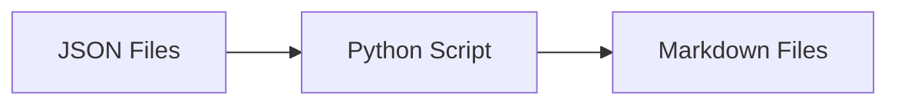

# linkedin_json_to_markdown_conversion Design Document

> **요약**: JSON 데이터를 읽어 Markdown 보고서로 변환하는 스크립트의 구조와 템플릿을 정의합니다.

---

## 1. 시스템 구조

### 1.1 데이터 흐름



### 1.2 모듈 구성

- `loader`: JSON 파일을 UTF-8 인코딩으로 읽어 Python 사전 객체로 변환.
- `transformer`: 포스트 리스트를 순회하며 Markdown 형식의 문자열로 변환.
- `writer`: 최종 문자열을 `.md` 파일로 저장 (UTF-8).

---

## 2. 세부 설계

### 2.1 Markdown 템플릿

각 파일 상단에 메타데이터 요약을 배치하고, 이후 개별 포스트를 구분선으로 나열합니다.

#### 헤더 섹션
```markdown
# LinkedIn Activity Report: {user_id}
- **추출 일시**: {crawled_at}
- **총 포스트 수**: {total_count}
```

#### 포스트 섹션
```markdown
---
### [{index}] {created_at_text}
- **원본 링크**: [바로가기]({url})
- **내용**:
{content}

- **이미지**:

```

### 2.2 예외 처리 및 고려 사항

- **이미지 없음**: 이미지 URL이 없을 경우 해당 섹션을 생략하거나 "이미지 없음" 텍스트로 대체.
- **긴 텍스트**: 본문이 매우 길 경우 Markdown 인용구(`>`) 등을 활용하여 구분.
- **인코딩**: `open(path, 'w', encoding='utf-8')`을 명시하여 한글 깨짐 방지.

---

## 3. 구현 계획

### 3.1 사용 도구

- **Language**: Python 3.x
- **Libraries**: `json`, `os`, `datetime`

### 3.2 작업 단계

1. 변환용 Python 스크립트 `json_to_md.py` 작성.
2. 지정된 2개 경로의 파일을 인자로 전달하여 실행.
3. 결과물인 `.md` 파일이 동일 폴더 또는 `docs` 폴더 내에 생성되는지 확인.

---

## 4. 검증 계획

- [ ] 생성된 Markdown 파일을 VS Code 등에서 미리보기하여 레이아웃 확인.
- [ ] 한글 텍스트가 정상적으로 인쇄되는지 확인.
- [ ] 이미지 태그가 실제 URL을 올바르게 가리키는지 확인.
