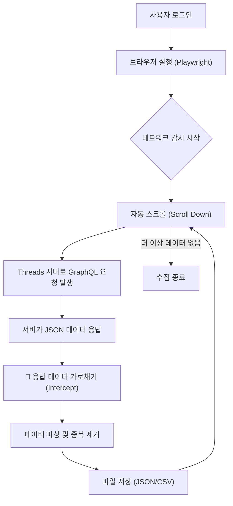

새로운 PM이 이 서비스의 **기술적 배경(왜 이렇게 만들었는지)**과 **작동 원리(어떻게 돌아가는지)**를 한눈에 이해할 수 있도록 작성된 기술 문서 초안입니다.

복잡한 코드는 배제하고, **비즈니스 로직과 데이터 흐름 중심**으로 작성되었습니다.

---

# [기술문서] Threads 저장 게시글 수집 서비스

| 문서 버전     | 1.0                                       |
| :------------ | :---------------------------------------- |
| **작성일**    | 2026. 01. 27                              |
| **대상 독자** | Product Manager, Stakeholders             |
| **핵심 기술** | Playwright, Network Interception, GraphQL |

---

## 1. 서비스 개요 (Overview)

본 서비스는 사용자의 Threads 계정에 **'저장됨(Saved)'**으로 분류된 게시글 데이터를 자동으로 수집(Crawling)하여 로컬 데이터베이스(JSON/CSV)로 저장하는 도구입니다.

### **개발 목적**

- 휘발성이 강한 SNS 데이터를 영구 보관 가능한 형태로 아카이빙
- 저장된 방대한 데이터를 검색, 분류, 재생산하기 위한 기초 데이터 확보

---

## 2. 핵심 기술적 이슈 : 왜 일반적인 방법으로는 안 되는가?

초기 개발 단계에서 일반적인 웹 크롤링 방식(HTML 파싱)을 시도했으나, Threads 웹사이트의 고유한 기술적 특성으로 인해 **데이터 누락**이 발생했습니다.

### **🚨 문제점: DOM Virtualization (가상화) 기술**

Threads는 사용자의 브라우저 메모리를 절약하기 위해 **'가상 스크롤(Virtual Scrolling)'** 기술을 사용합니다.

- **현상:** 사용자가 스크롤을 내려 100번째 글을 보고 있을 때, 브라우저는 메모리 확보를 위해 **이미 지나간 1~80번째 글을 화면(HTML 코드)에서 지워버립니다.**
- **결과:** 스크롤을 끝까지 내린 후 페이지를 저장해도, 파일에는 **마지막에 로딩된 일부 게시글만 남아있고 앞부분 데이터는 모두 소실**됩니다.

> **PM을 위한 비유:**
>
> 마치 **'회전초밥 레일'**과 같습니다. 내 눈앞에 지나가는 초밥만 집을 수 있고, 이미 지나가 버린 초밥은 레일 끝에서 사라져 버려 다시는 집을 수 없는 구조입니다.

---

## 3. 해결 솔루션 : Network Interception (네트워크 패킷 탈취)

우리는 화면에 보이는 글자(HTML)를 긁는 방식을 포기하고, **브라우저와 서버가 주고받는 통신(Network Traffic)을 가로채는 방식**을 채택했습니다.

### **✅ 접근 방식**

1. **자동화 브라우저(Playwright)**를 실행하여 사용자가 로그인을 완료하게 합니다.
2. 프로그램이 자동으로 스크롤을 내려 서버에 **"다음 데이터 주세요"**라는 요청을 보내게 유도합니다.
3. 서버가 브라우저에게 보내주는 **JSON 데이터 꾸러미(Response Packet)**를 중간에서 가로채서 저장합니다.

### **이 방식의 장점**

- **데이터 무결성:** 화면에서 게시글이 사라져도, 서버가 보낸 원본 데이터 기록은 남아있으므로 100% 수집 가능합니다.
- **속도:** HTML을 분석하는 복잡한 과정 없이, 정제된 JSON 데이터를 바로 사용하므로 처리 속도가 매우 빠릅니다.
- **정확성:** 이미지 URL, 작성자 ID, 작성 시간 등 메타 데이터가 정확하게 명시되어 있습니다.

---

## 4. 서비스 작동 프로세스 (Workflow)

---

## 5. 수집 데이터 명세

서버로부터 받아오는 `graphql/query` 응답 데이터(`saved_media`)에서 추출 가능한 주요 정보는 다음과 같습니다.

| 필드명         | 설명                   | 비고                                                    |
| :------------- | :--------------------- | :------------------------------------------------------ |
| **pk**         | 게시글 고유 ID         | 데이터 중복 방지 키(Key)로 사용                         |
| **code**       | 게시글 URL 코드        | `https://threads.net/post/{code}` 형태로 링크 생성 가능 |
| **username**   | 작성자 ID              |                                                         |
| **caption**    | 게시글 본문            | 텍스트 데이터                                           |
| **image_url**  | 이미지/영상 리소스 URL | 여러 장일 경우 리스트 형태로 수집                       |
| **like_count** | 좋아요 수              |                                                         |
| **timestamp**  | 작성 일시              | UNIX 타임스탬프로 제공됨                                |

---

## 6. PM이 알아두어야 할 제약 사항 및 리스크

### **1) 세션 만료 (Session Expiry)**

- 이 서비스는 사용자의 로그인 정보(Cookie)를 기반으로 작동합니다.
- 일정 시간이 지나거나 브라우저를 닫으면 로그인이 풀릴 수 있으므로, **수집 시마다 로그인이 필요**할 수 있습니다.

### **2) API 변경 가능성**

- Threads가 내부 API 구조(`graphql` 쿼리 형태)를 변경할 경우, 데이터 수집이 중단될 수 있습니다.
- **대응:** 수집 실패 시, 개발자가 응답 JSON 구조를 확인하고 코드를 업데이트해야 합니다. (유지보수 포인트)

### **3) 과도한 요청 제한 (Rate Limiting)**

- 너무 빠른 속도로 스크롤을 내리거나 단시간에 수천 개의 글을 수집하려 하면, Threads 서버가 로봇으로 간주하고 **일시적 차단**을 할 수 있습니다.
- **대응:** 코드 내에 `sleep(2)`와 같은 대기 시간을 두어 인간처럼 천천히 행동하도록 설정되어 있습니다.

---

## 7. 요약 (Summary)

이 서비스는 **눈에 보이는 화면을 찍는 것(스크린샷)**이 아니라, **서버에서 오는 우편물을 중간에 복사(패킷 캡처)**하는 방식으로 작동합니다. 이를 통해 Threads의 기술적 제약(화면에서 글이 사라지는 현상)을 극복하고, 누락 없는 완벽한 데이터 수집을 구현했습니다.

- **입력:** 사용자 로그인
- **동작:** 자동 스크롤 & 네트워크 패킷 캡처
- **출력:** 완벽한 형태의 JSON 데이터 파일
