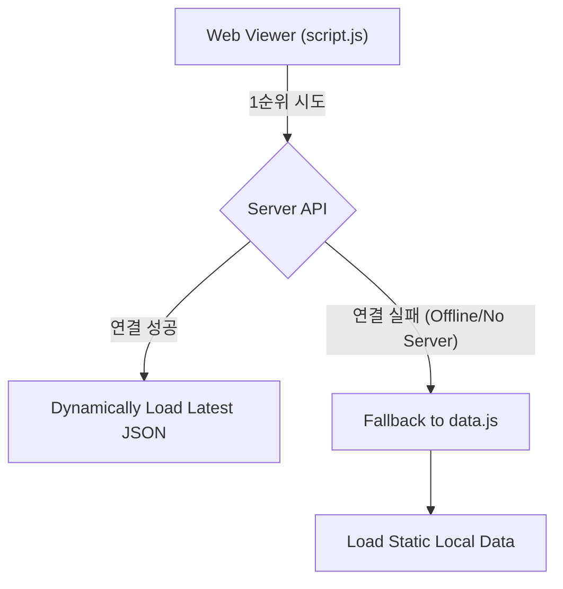

# 📄 데이터 로딩 구조 검토 보고서 (Data Loading Strategy Review)

**작성일**: 2026-02-06
**작성자**: Antigravity Assistant

---

## 1. 개요 (Executive Summary)

현재 웹 뷰어(`index.html`)가 최신 크롤링 데이터(`20260206.json`)를 자동으로 반영하지 못하는 문제의 원인을 분석하고, 기존 시스템의 설계 의도(`Serverless Local Support`)를 훼손하지 않는 해결책을 제시합니다.

## 2. 현상 분석

### 2.1 문제점

- 새로운 데이터 파일(`output_total/total_full_*.json`)이 생성되어도 웹 뷰어는 업데이트되지 않음.
- `script.js` 내에 데이터 로드 경로가 특정 파일로 하드코딩 되어 있음.
- `data.js` 파일이 과거 시점(2월 5일) 데이터에 머물러 있음.

### 2.2 `data.js`의 존재 이유 (Historical Context)

Git 히스토리 및 `docs/development.md` 분석 결과, `data.js`는 단순한 레거시가 아닌 **핵심 기능**으로 확인되었습니다.

- **목적**: 로컬 환경(`file://` 프로토콜) 실행 지원.
- **기술적 배경**:
  - 브라우저 보안 정책(CORS)으로 인해, 로컬 HTML 파일에서 로컬 JSON 파일을 `fetch` API로 읽는 것이 차단됨.
  - 이를 우회하기 위해 **JSON 데이터를 자바스크립트 객체(`window.snsFeedData`)로 래핑한 파일(`data.js`)**을 생성하여 `<script>` 태그로 로드하는 방식을 채택함.
- **기존 워크플로우**: Python 스크래퍼 실행 완료 시점에 `data.js`를 자동으로 갱신하도록 설계됨.

## 3. 해결 방안: 하이브리드 로딩 (Hybrid Loading Strategy)

기존의 편의성(Local Run)과 새로운 요구사항(Dynamic Update)을 모두 만족하기 위해 **이중 로딩 전략**을 제안합니다.

### 3.1 아키텍처

### 3.2 상세 구현 계획

1.  **Backend (`server.py`)**
    - **기능**: `/api/latest-data` 엔드포인트 신설.
    - **로직**: `output_total` 디렉토리를 스캔하여 가장 최신의 `total_full_*.json` 파일을 찾아 반환.
    - **장점**: 파일명이 변경되거나 새로 생성되어도 서버 코드 수정 없이 즉시 반영.

2.  **Frontend (`script.js`)**
    - **기능**: 데이터 로드 함수(`fetchData`) 개선.
    - **로직**:
      1. `http://localhost:5000/api/latest-data` 호출 시도.
      2. 성공 시: 최신 데이터를 렌더링하고 "Live Mode" 표시.
      3. 실패 시: 전역 변수 `snsFeedData`(`data.js`) 확인 및 렌더링, "Offline Mode" 알림 표시.

## 4. 기대 효과

- **최신성 보장**: 서버 실행 중에는 별도의 작업 없이 항상 최신 크롤링 결과를 볼 수 있습니다.
- **호환성 유지**: 서버 없이 HTML 파일만 더블 클릭해도(데이터가 조금 구버전일지라도) 뷰어가 정상 작동합니다.
- **유지보수성**: 날짜별로 파일명을 하드코딩해서 수정하던 작업을 제거합니다.

---

**결론**: `data.js` 삭제 없이 하이브리드 로딩 방식을 적용하여 시스템을 고도화하는 것을 권장합니다.
