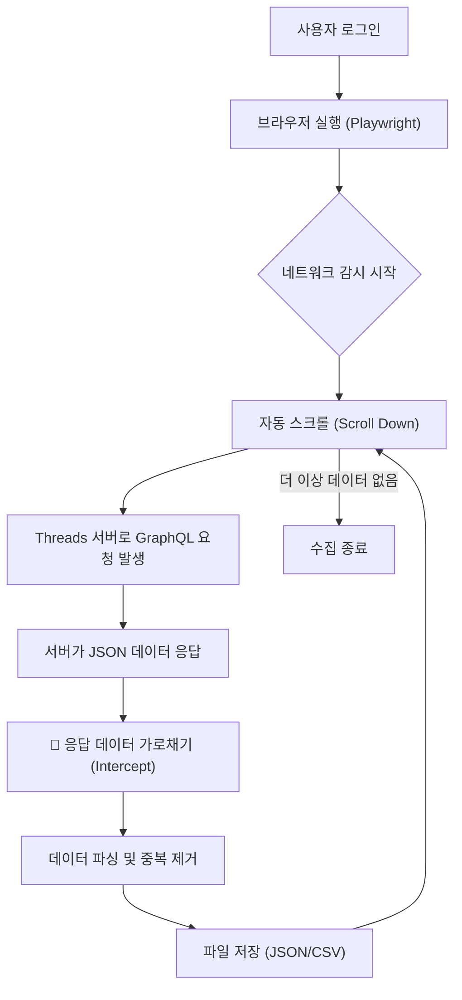

# SNS Crawler 프로젝트 개발 및 인수인계 가이드

이 문서는 Threads 및 LinkedIn 저장물 크롤러의 데이터 추출 규칙과 기술적 세부 사항을 정리한 문서입니다. 프로젝트 유지보수 및 인수인계 시 참고하시기 바랍니다.

---

## 1. LinkedIn 크롤링 및 데이터 추출 규칙

LinkedIn은 Voyager GraphQL API를 사용하며, 복잡한 데이터 구조를 가지고 있습니다.

### 🔍 데이터 소스

- **엔드포인트**: `voyager/api/graphql` (Search SRP 응답)
- **추출 대상**: `included` 배열 내 `$type`이 `com.linkedin.voyager.dash.search.EntityResultViewModel`인 객체

### 🛠️ 필드 매핑 및 변환 로직

1.  **작성 일자 (Snowflake ID 디코딩)**
    - LinkedIn은 `taken_at` 필드가 없으므로 `entityUrn`의 숫자 ID를 디코딩하여 절대 시간을 추출합니다.
    - **로직**: `(ID_int >> 22) + LinkedIn_Epoch_MS`
    - **우선순위**: 디코딩된 절대 시간 > `time_text` 감지 및 역산 > 크롤링 시점(`crawled_at`)
2.  **상대적 시간 역산 (`time_text`)**
    - "1주", "3일", "5시간" 등의 텍스트를 정규식으로 분석하여 크롤링 시점으로부터 `timedelta`를 계산해 절대 시간으로 변환 후 저장합니다.
3.  **이미지 수집**
    - `image.attributes` 배열의 `detail` 정보를 활용합니다.
    - `rootUrl` 뒤에 `artifacts` 배열 중 가장 큰 해상도의 `fileIdentifyingUrlPathSegment`를 붙여 완성합니다.
    - **Fallback**: `imageUrl.url` 필드 직접 참조.

---

## 2. Threads 크롤링 및 데이터 추출 규칙

Threads는 비교적 직관적인 JSON 구조를 가지며, 절대 타임스탬프를 제공합니다.

### 🔍 데이터 소스

- **루트 경로**: `data.xdt_text_app_viewer.saved_media.edges`
- **개별 객체**: `node.thread_items[0].post`

### 🛠️ 필드 매핑 및 변환 로직

1.  **작성 일자 (`taken_at`)**
    - **필드**: `post.taken_at` (Unix Timestamp, 초 단위)
    - **변환**: Python의 `datetime.fromtimestamp()`를 사용하여 즉시 절대 시간으로 변환합니다.
2.  **이미지 및 캐러셀**
    - **단일 이미지**: `post.image_versions2.candidates[0].url`
    - **캐러셀 (여러 장)**: `post.carousel_media` 배열을 순회하며 각 아이템의 `image_versions2.candidates[0].url`을 수집합니다.
3.  **원본 링크 생성**
    - **공식**: `https://www.threads.com/@{username}/post/{post.code}` (여기서 `code`는 게시물 고유 코드)

---

## 3. 공통 데이터 구조 (Output JSON)

모든 크롤러는 최종적으로 다음 규격의 JSON 객체를 생성해야 합니다.

```json
{
  "code": "게시물 고유 ID (activity_id 또는 pk)",
  "username": "작성자 이름",
  "text": "본문 텍스트",
  "created_at": "YYYY-MM-DD HH:MM:SS (절대 시간)",
  "crawled_at": "YYYY-MM-DD HH:MM:SS (수집 시점)",
  "time_text": "YYYY-MM-DD (역산된 절대 시간 문자열)",
  "images": ["url1", "url2"],
  "post_url": "원본 게시물 링크"
}
```

---

## 4. 주의 사항 및 유지보수

- **세션 관리**: LinkedIn은 쿠키 세션이 만료될 경우 크롤링이 중단되므로 수동 로그인이 주기적으로 필요할 수 있습니다.
- **날짜 정확도**: `time_text` 역산은 크롤러 실행 시점에 따라 오차(최대 1일)가 발생할 수 있으므로, 항상 Snowflake ID 디코딩 결과를 최우선으로 신뢰합니다.
- **Selector 변경**: SNS 플랫폼의 UI 업데이트로 인해 CSS Selector나 JSON 경로가 변경될 수 있으므로, 응답이 비어있을 경우 `docs` 폴더의 최신 `response.json`을 재분석하십시오.

---

## 5. 최근 이슈 해결 및 업데이트 로그 (2026-02-01)

### LinkedIn 스크래퍼 이슈

1. **10개 수집 제한 (Pagination) 해결**
   - **문제**: "결과 더보기" 버튼 클릭이 필요한 UI 변경으로 인해 스크롤만으로는 10개 이상의 데이터 로드 불가.
   - **해결**: `linkedin_scrap.py`에 "결과 더보기" 버튼 자동 감지 및 클릭 로직(`page.locator('button:has-text("결과 더보기")')`) 추가.
   - **결과**: 140개 이상의 전체 데이터 수집 정상화.

2. **메타데이터 오류 수정**
   - **문제**: 내부 필드명 불일치(`collected_at` vs `crawled_at`)로 검증된 데이터 카운트 오류.
   - **해결**: 필드명 통일 및 기존 데이터 보정 완료.

### 웹 뷰어 (Web Viewer) 표시 이슈

1. **링크드인 이미지 미표시**
   - **원인**: `weserv.nl` 프록시가 LinkedIn CDN(`licdn.com`) 요청 처리 실패.
   - **해결**: `script.js`에서 `licdn.com` 이미지는 프록시를 우회하여 직접 로드하도록 예외 처리.

2. **날짜 표시 오류 (1970. 1. 1.)**
   - **원인**: `YYYY-MM-DD HH:MM:SS` 공백 포맷의 브라우저 호환성 문제 및 `data.js` 미갱신.
   - **해결**: 날짜 문자열의 공백을 `T`로 치환(ISO 8601 준수)하여 파싱 안정성 확보.

3. **로컬 실행(CORS) 지원**
   - **문제**: `file:///` 프로토콜에서 JSON Fetch 차단.
   - **해결**: `total_scrap.py` 종료 시 최신 데이터를 `web_viewer/data.js`로 자동 변환 저장하는 로직 추가. 웹 뷰어는 `data.js`를 우선 로드하여 로컬 실행 지원.

---

## 6. [부록] Threads 크롤러 아키텍처 및 기획 배경

_(Original Source: `docs/crawling_logic.md`)_

### 1. 서비스 개요 (Overview)

본 서비스는 사용자의 Threads 계정에 **'저장됨(Saved)'**으로 분류된 게시글 데이터를 자동으로 수집(Crawling)하여 로컬 데이터베이스(JSON/CSV)로 저장하는 도구입니다.

**개발 목적**

- 휘발성이 강한 SNS 데이터를 영구 보관 가능한 형태로 아카이빙
- 저장된 방대한 데이터를 검색, 분류, 재생산하기 위한 기초 데이터 확보

### 2. 핵심 기술적 이슈 : 왜 일반적인 방법으로는 안 되는가?

초기 개발 단계에서 일반적인 웹 크롤링 방식(HTML 파싱)을 시도했으나, Threads 웹사이트의 고유한 기술적 특성으로 인해 **데이터 누락**이 발생했습니다.

**🚨 문제점: DOM Virtualization (가상화) 기술**

Threads는 사용자의 브라우저 메모리를 절약하기 위해 **'가상 스크롤(Virtual Scrolling)'** 기술을 사용합니다.

- **현상:** 사용자가 스크롤을 내려 100번째 글을 보고 있을 때, 브라우저는 메모리 확보를 위해 **이미 지나간 1~80번째 글을 화면(HTML 코드)에서 지워버립니다.**
- **결과:** 스크롤을 끝까지 내린 후 페이지를 저장해도, 파일에는 **마지막에 로딩된 일부 게시글만 남아있고 앞부분 데이터는 모두 소실**됩니다.

> **PM을 위한 비유:**
> 마치 **'회전초밥 레일'**과 같습니다. 내 눈앞에 지나가는 초밥만 집을 수 있고, 이미 지나가 버린 초밥은 레일 끝에서 사라져 버려 다시는 집을 수 없는 구조입니다.

### 3. 해결 솔루션 : Network Interception (네트워크 패킷 탈취)

우리는 화면에 보이는 글자(HTML)를 긁는 방식을 포기하고, **브라우저와 서버가 주고받는 통신(Network Traffic)을 가로채는 방식**을 채택했습니다.

**✅ 접근 방식**

1. **자동화 브라우저(Playwright)**를 실행하여 사용자가 로그인을 완료하게 합니다.
2. 프로그램이 자동으로 스크롤을 내려 서버에 **"다음 데이터 주세요"**라는 요청을 보내게 유도합니다.
3. 서버가 브라우저에게 보내주는 **JSON 데이터 꾸러미(Response Packet)**를 중간에서 가로채서 저장합니다.

**이 방식의 장점**

- **데이터 무결성:** 화면에서 게시글이 사라져도, 서버가 보낸 원본 데이터 기록은 남아있으므로 100% 수집 가능합니다.
- **속도:** HTML을 분석하는 복잡한 과정 없이, 정제된 JSON 데이터를 바로 사용하므로 처리 속도가 매우 빠릅니다.
- **정확성:** 이미지 URL, 작성자 ID, 작성 시간 등 메타 데이터가 정확하게 명시되어 있습니다.

### 4. 서비스 작동 프로세스 (Workflow)



### 5. PM이 알아두어야 할 제약 사항 및 리스크

**1) 세션 만료 (Session Expiry)**

- 이 서비스는 사용자의 로그인 정보(Cookie)를 기반으로 작동합니다.
- 일정 시간이 지나거나 브라우저를 닫으면 로그인이 풀릴 수 있으므로, **수집 시마다 로그인이 필요**할 수 있습니다.

**2) API 변경 가능성**

- Threads가 내부 API 구조(`graphql` 쿼리 형태)를 변경할 경우, 데이터 수집이 중단될 수 있습니다.
- **대응:** 수집 실패 시, 개발자가 응답 JSON 구조를 확인하고 코드를 업데이트해야 합니다. (유지보수 포인트)

**3) 과도한 요청 제한 (Rate Limiting)**

- 너무 빠른 속도로 스크롤을 내리거나 단시간에 수천 개의 글을 수집하려 하면, Threads 서버가 로봇으로 간주하고 **일시적 차단**을 할 수 있습니다.
- **대응:** 코드 내에 `sleep(2)`와 같은 대기 시간을 두어 인간처럼 천천히 행동하도록 설정되어 있습니다.

### 6. 요약 (Summary)

## 이 서비스는 **눈에 보이는 화면을 찍는 것(스크린샷)**이 아니라, **서버에서 오는 우편물을 중간에 복사(패킷 캡처)**하는 방식으로 작동합니다. 이를 통해 Threads의 기술적 제약(화면에서 글이 사라지는 현상)을 극복하고, 누락 없는 완벽한 데이터 수집을 구현했습니다.

## 7. 이미지 로드 이슈 분석 및 대응 방안

웹 뷰어에서 Threads(Meta 인프라) 게시물의 이미지가 간헐적으로 로드되지 않거나 `ERR_QUIC_PROTOCOL_ERROR`가 발생하는 현상에 대한 기술적 분석과 해결책을 정리합니다.

### 🔍 이슈 분석

1.  **Meta 인프라 공유**: Threads는 인스타그램의 CDN(`scontent.cdninstagram.com`)을 공유합니다. 따라서 쓰레드 데이터를 크롤러가 수집해도 이미지 원본 주소는 인스타그램 도메인으로 나타납니다.
2.  **QUIC 프로토콜 충돌**: `ERR_QUIC_PROTOCOL_ERROR`는 브라우저와 Meta 서버 간의 HTTP/3 통신 중 UDP 포트 차단이나 네트워크 간섭이 발생할 때 나타납니다.
3.  **CORS 및 Hotlinking**: Meta CDN은 보안 정책상 외부 웹사이트에서의 직접적인 이미지 호출을 제한할 수 있어 프록시 서버 사용이 권장됩니다.

### 🛠️ 개선 전후 비교 및 기대 효과

| 구분              | 개선 전 (Before)                  | 개선 후 (After)                                                          |
| :---------------- | :-------------------------------- | :----------------------------------------------------------------------- |
| **요청 구조**     | 브라우저 → 구형 프록시 → Meta CDN | 브라우저 → 신규 프록시(`wsrv.nl`) → Meta CDN / **[실패 시] 원본 재시도** |
| **에러 핸들링**   | 없음 (엑스박스 노출)              | `onerror` 이벤트를 통한 **자동 복구 로직** 탑재                          |
| **프로토콜 대응** | QUIC 에러 시 로드 실패            | 에러 발생 시 표준 프로토콜로 재요청하여 안정성 확보                      |
| **성능/속도**     | `images.weserv.nl` (느림)         | 고성능 캐싱 프록시 도메인 적극 활용                                      |

### 🚀 적용된 해결책 (Web Viewer)

- **동적 폴백(Fallback) 구현**: 이미지 로드 실패 시 원본 URL로 즉시 재시도하거나 대체 플레이스홀더를 사용하는 다단계 방어 로직을 `script.js`에 적용했습니다.
- **비디오 파일(.mp4) 전용 처리**: 비디오 파일이 이미지 태그로 로드되어 에러가 발생하는 것을 방지하기 위해 확장자를 감지하여 전용 플레이스홀더와 원본 링크 버튼을 표시하도록 개선했습니다.
- **렌더링 방식 변경**: `background-image` 대신 `img` 태그와 `object-fit: cover` 조합을 사용하여 브라우저의 전역 에러 핸들링 기능을 활용하도록 개선했습니다.
- **프록시 최적화**: 구형 `weserv.nl` 도메인에서 최신 고성능 도메인인 `wsrv.nl`로 교체하여 초기 로딩 지연 시간을 단축했습니다.
- **보안 정책(Referrer Policy) 조정**: `index.html`에 `<meta name="referrer" content="no-referrer">`를 설정하여 Meta CDN의 직접 접근 시 발생하는 403 Forbidden 에러를 최소화했습니다.

---

## 8. 메뉴 아이콘 깨짐(FOUT) 현상 분석 및 해결 (2026-02-05)

### 🔍 이슈 현상

- 페이지 로딩 시 상단 메뉴 아이콘이 잠시 "search", "hub" 등의 **텍스트로 노출**되었다가 아이콘으로 변환되는 현상 발생 (Flash of Unstyled Text).

### 🛠️ 원인 분석

- **Google Fonts 로딩 옵션**: `Material Symbols` 폰트를 로드할 때 `display=swap` 옵션을 사용.
- **동작 원리**: `swap`은 폰트 파일 다운로드 전까지 브라우저 기본 폰트로 텍스트를 먼저 보여주므로, 아이콘 폰트(Ligatures)가 적용되기 전의 원본 텍스트가 노출됨.

### 🚀 해결책

- `index.html`의 폰트 링크 옵션을 **`display=block`**으로 변경.
- **효과**: 폰트 로딩 전까지 텍스트를 숨김 처리하여, 로딩 완료 후 아이콘이 즉시 나타나도록 개선 (깔끔한 시각적 경험).

---

## 9. 자동 태그(Auto-Run) 성능 분석 보고서 (2026-02-05)

### 1. 분석 개요

`fetchData()` 내부에서 `applyAutoTags()`를 자동 실행하는 로직의 성능 영향을 분석하였습니다.

- **대상 파일**: `web_viewer/script.js`
- **핵심 로직**: 데이터 로드 직후 `applyAutoTags(allPosts, true)` 호출

### 2. 성능 복잡도 분석

이 로직의 시간 복잡도는 **O(N × R)**입니다.

- **N**: 전체 게시물 수 (Total Posts)
- **R**: 등록된 자동 태그 규칙 수 (Rules)

#### 프로세스 흐름

1. 전체 게시물 루프 (N회)
2. 각 게시물마다 규칙 루프 (R회)
3. 텍스트 포함 여부 검사 (`text.includes(keyword)`)
4. **[최적화됨]** 이미 태그가 존재하는지 확인 (`!tags.includes(tagName)`)
5. 변경사항이 있을 경우에만 `localStorage` 저장 (`updateCount > 0` 조건)

### 3. 시나리오별 예상 부하

#### A. 일반적인 사용 (게시물 5,000개 미만, 규칙 50개 미만)

- **예상 소요 시간**: 10~50ms 미만 (거의 즉시)
- **체감 성능**: **영향 없음**. 사용자는 지연을 느끼지 못함.

#### B. 대량 데이터 (게시물 10,000개 이상)

- **예상 소요 시간**: 100ms ~ 300ms
- **체감 성능**: 페이지 로드 시 아주 미세한 "멈칫" 현상이 있을 수 있으나, 치명적이지 않음.

#### C. 저장소 부하 (LocalStorage)

- `localStorage`는 동기(Synchronous) 방식으로 작동하여 쓰기 작업 시 메인 스레드를 차단합니다.
- **안전 장치**: 현재 코드는 `modified` 플래그를 사용하여 **실제 새로운 태그가 적용될 때만** 저장을 수행합니다.
- 따라서, 규칙이 이미 적용된 상태에서 새로고침 시에는 **저장 연산이 건너뛰어지므로 성능 저하가 없습니다.**

### 4. 결론 및 제언

**Q: 로딩이 오래 걸리거나 퍼포먼스에 크리티컬한 저하가 생기는가?**
**A: 아니요, 현재 구조에서는 크리티컬한 저하가 발생하지 않습니다.**

#### 이유:

1. **텍스트 매칭 속도**: 자바스크립트 엔진의 문자열 검색 속도는 매우 빠릅니다.
2. **조건부 저장**: 매번 `localStorage`를 덮어쓰지 않고, 변경 사항이 있을 때만 씁니다.
3. **중복 방지**: 이미 태그가 있으면 로직을 건너뜁니다.

---

## 10. 자동 태그(Auto-Tag) 시스템 및 매칭 로직 (2026-02-05)

사용자가 설정한 키워드 규칙 또는 기존 태그를 기반으로 게시물에 자동으로 태그를 부여하는 시스템의 기술적 명세입니다.

### 1. 규칙 생성 방식 (Hybrid Rule System)

두 가지 소스를 병합하여 규칙을 생성합니다.

1.  **수동 규칙 (Manual Rules)**: 사용자가 설정 모달에서 직접 입력한 `[키워드] -> [태그]` 매핑.
2.  **암시적 규칙 (Implicit Rules)**: 현재 시스템에 존재하는 **모든 고유 태그**를 키워드로 간주.
    - 예: 어떤 게시물에 `#AI` 태그가 있다면, 다른 게시물 본문에 "AI"라는 단어가 등장할 경우 자동으로 `#AI` 태그를 추천/부여.

### 2. 매칭 알고리즘: 단어 단위 매칭 (Whole Word Matching)

단순 문자열 포함(`includes`) 방식의 오탐지(False Positive)를 방지하기 위해 **정규표현식(Regex)**을 도입했습니다.

- **변경 전**: `includes('IT')` -> "VIS**IT**", "WA**IT**" 등도 매칭되는 문제.
- **변경 후**: `RegExp`를 사용하여 **단어 경계(Word Boundary)**를 검사.

**매칭 정규식 패턴**

```javascript
const pattern = new RegExp(
  `(^|[^a-z0-9_가-힣])${escaped}(?![a-z0-9_가-힣])`,
  "i",
);
```

- **동작 원리**:
  - 키워드 앞뒤에 **알파벳, 숫자, 밑줄, 한글**이 오지 않아야 함.
  - 공백, 문장 부호(.,!?), 줄바꿈 등은 경계로 인식.
  - `i` 플래그: 대소문자 구분 없음 (Case Insensitive).

### 3. 일괄 업데이트 (Batch Update) 프로세스

설정 모달의 **'Tag 일괄 업데이트'** 버튼 실행 시 동작입니다.

1.  **비동기 처리**: UI 멈춤 방지를 위해 `requestAnimationFrame`을 사용하여 100개 단위로 청크(Chunk) 처리.
2.  **진행률 표시**: 실시간 프로그레스 바 제공.
3.  **결과 리포트**:
    - 업데이트된 게시물 수, 규칙 수, 감지/건너뜀 통계 표시.

---

## 11. CSS 오버라이딩 이슈 및 해결 (2026-02-05)

### 🔍 이슈 현상

- `.tag-input` 클래스에서 `font-size: 0.75rem`을 지정했으나 적용되지 않고 기본 크기로 표시됨.

### 🛠️ 원인 분석

- **Tailwind CSS Reset**: Tailwind의 Preflight CSS가 모든 `input` 요소에 대해 기본 스타일(normalize)을 적용.
- **우선순위(Specificity)**: Tailwind의 유틸리티 클래스나 리셋 스타일이 커스텀 CSS 클래스보다 우선순위가 높게 작용하거나 충돌 발생.

### 🚀 해결책

- `.tag-input` 스타일 정의에 **`!important`** 추가하여 강제 적용.

---

## 12. Threads 데이터 저장 구조 개편 및 타래글 수집 엔진 (2026-02-06)

### 1. 개요

기존 단일 패스(Single Pass) 방식의 한계를 극복하고, Threads의 **'타래글(Thread)'** 구조를 완벽하게 수집하기 위해 **Producer-Consumer 아키텍처**를 도입했습니다.

### 2. 데이터 아키텍처 분리 (Simple vs Full)

데이터의 '해상도'에 따라 저장소를 물리적으로 분리하여 관리 효율성과 데이터 안정성을 확보했습니다.

| 구분              | 파일명 패턴                | 역할                                                                     | 특징                             |
| :---------------- | :------------------------- | :----------------------------------------------------------------------- | :------------------------------- |
| **Simple (목록)** | `threads_py_simple_*.json` | **[Producer]** 수집된 게시물의 기본 정보 (URL, 작성자, 스니펫)           | 빠르고 가벼움. 수집 대상 식별용. |
| **Full (상세)**   | `threads_py_full_*.json`   | **[Consumer]** 본문 전체, 답글(Replies), 이미지가 포함된 고해상도 데이터 | 무겁고 상세함. 최종 아카이빙용.  |

### 3. 타래글 수집 및 병합 엔진

단순히 본문만 긁던 방식에서 벗어나, **"하나의 주제로 묶인 타래글"** 전체를 하나의 컨텍스트로 결합합니다.

#### A. 그룹화 (Grouping)

- `root_code`를 기준으로 메인 포스트와 연관된 답글들을 자동으로 식별하여 그룹핑합니다.
- **필터링 조건**: 작성자 일치 여부, 답글 체인(Reply-to) 검증을 통해 타인의 댓글이나 맥락 없는 글은 배제합니다.

#### B. 텍스트 결합 (Concatenation)

- 그룹핑된 여러 개의 포스트(본문 + 답글 1, 2, 3...)를 시간순으로 정렬 후 텍스트를 결합합니다.
- **구분자**: `\n\n---\n\n`을 사용하여 가독성을 유지합니다.
- **이미지 통합**: 각 포스트에 흩어진 이미지들을 하나의 `images` 배열로 중복 없이 통합합니다.

### 4. 수집 안정성 강화 (Reliability)

#### A. 자동 재시도 (Automatic Retry)

- 네트워크 불안정이나 로딩 지연으로 인해 **'No data found'**가 발생할 경우, 1차 수집 종료 후 **실패한 항목만 모아서 자동으로 2차 시도(Retry Pass)**를 수행합니다.
- 이로 인해 수집 성공률이 비약적으로 상승했습니다.

#### B. 중복 방지 (Idempotency)

- **`is_merged_thread` 플래그**: 상세 수집이 완료된 항목에 마킹하여, 이후 실행 시 중복 수집을 원천적으로 방지합니다.
- **Max Sequence ID 자동 보정**: 신규 데이터 추가 시 메타데이터의 ID를 자동으로 재계산하여 정합성을 유지합니다.

---
