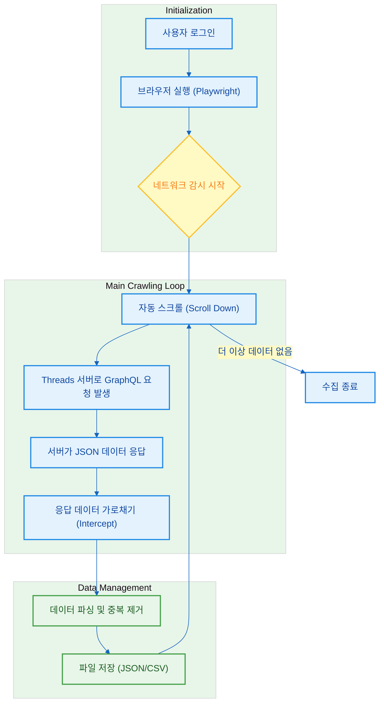

# README.md Mermaid 다이어그램 디자인 진단 보고서

`mermaid-expert` 스킬을 바탕으로 현재 [README.md](file:///d:/vibe-coding/scrap_sns/README.md)에 적용된 다이어그램을 분석하고, 디자인적 완성도를 높이기 위한 개선 방안을 제안합니다.

## 1. 디자인 진단 (Diagnosis)

### 주요 문제점

- **텍스트 배경색 부자연스러움**: 현재 일부 렌더러(VSCode 등)에서 노드 내부의 텍스트 레이블이 불투명한 검은색 배경을 가지는 현상이 발생합니다. 이는 다이어그램의 테마와 텍스트가 조화롭지 못할 때 나타나는 전형적인 현상입니다.
- **시각적 계층 부족**: 모든 과정이 동일한 사각형 노드로 표현되어 있어, '사용자 입력', '시스템 처리', '반복 루프' 등의 구분이 명확하지 않습니다.
- **테마 미지정**: 기본 테마를 사용하고 있어 주변 문서(Markdown)의 스타일과 이질감이 느껴질 수 있습니다.

## 2. 디자인 개선 제안 (Proposals)

### 해결책 1: 테마 초기화 디렉티브 (Directives) 활용

다이어그램 최상단에 `%%{init: { ... }}%%` 블록을 추가하여 전역 스타일을 제어합니다. 이를 통해 텍스트 배경색을 투명하게 하거나 특정 색상으로 고정하여 "검은 배경" 문제를 즉시 해결할 수 있습니다.

### 해결책 2: 클래스 기반 스타일링 (classDef)

각 단계의 성격에 따라 스타일을 정의하여 시각적 인지도를 높입니다.

- **Action**: 시스템 동작 (파란색 계열)
- **Decision**: 조건 판단 (다이아몬드형, 노란색 계열)
- **Data**: 데이터 처리/저장 (녹색 계열)

### 해결책 3: 논리적 그룹화 (subgraph) 활용

크롤링 프로세스를 '준비(Setup)', '핵심 루프(Core Loop)', '저장(Storage)' 단계로 그룹화하여 흐름을 더 직관적으로 만듭니다.

---

## 3. 개선된 다이어그램 예시 (코드 제안)

아래 코드는 에러를 일으키지 않으면서 디자인을 극대화한 버전입니다. (현재 파일에 적용하지는 않습니다.)

## 4. 요약

제안된 버전을 사용하면 **텍스트 배경색 문제는 `themeVariables` 설정을 통해 해결**되며, `subgraph`와 `classDef`를 통해 설계 의도가 훨씬 더 전문적으로 보입니다.
