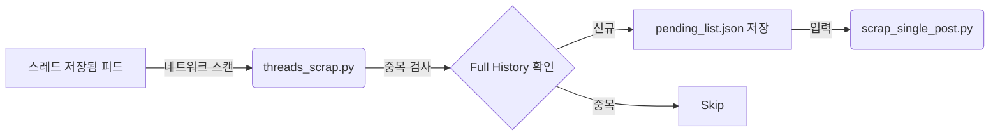

# 계획: threads_scrap.py 경량화 (Producer)

## 목표

`threads_scrap.py`를 2-Pass 아키텍처의 **Producer** 역할로 전담하도록 리팩토링합니다. 대상 URL을 발견하고 추출하는 것에만 집중하며, 가볍고 빠르게 동작해야 합니다.

## 핵심 역할

1.  **피드 스캔**: `https://www.threads.net/saved` 페이지에 접속하여 스크롤합니다.
2.  **URL 추출**: 네트워크 응답(`graphql`)을 가로채서 `code`(게시글 ID), `username`, `captured_at`(수집 시간) 정보만 추출합니다.
3.  **중복 제거**: 기존 Full History 파일(`threads_py_full_*.json`)을 로드하여, 이미 수집된 코드는 건너뜁니다.
4.  **큐(Queue) 관리**: 새롭게 발견된 고유한 코드를 `pending_list.json` 파일에 저장하여 Consumer가 처리할 수 있게 합니다.

## 제거되는 기능 (군더더기 삭제)

- 이미지 URL 추출 및 해상도 비교 로직
- 본문 텍스트 파싱 및 클리닝 로직
- 최종 결과(`scrap_result_*.json`) 저장 로직 (이 역할은 Consumer로 이관됨)
- 복잡한 미디어 타입 처리 (Carousel/Video 등)

## 데이터 흐름 (Data Flow)



## JSON 구조 (`pending_list.json`)

```json
[
  {
    "code": "PostCode123",
    "url": "https://www.threads.net/t/PostCode123",
    "username": "user_id",
    "captured_at": "2024-01-01T12:00:00"
  }
]
```

## 로직 의사코드 (Python Pseudo-code)

```python
def run():
    # 1. 기존 수집 내역 로드
    existing_codes = load_history()

    with sync_playwright() as p:
        # 2. 로그인 및 저장됨 페이지 이동
        page.goto("https://www.threads.net/saved")

        # 3. 네트워크 핸들러 등록
        def handle_response(response):
            if "graphql" in url:
                code = extract_code(response)
                # 이미 수집된 글이면 중단 신호
                if code in existing_codes:
                    stop_crawling = True
                else:
                    # 신규 글이면 리스트에 추가 (상세 파싱 X)
                    items.append({"code": code, ...})

        # 4. 스크롤 루프
        while not stop_crawling:
            scroll_down()

    # 5. Pending 리스트 저장
    save_to_file("pending_list.json", items)
```
